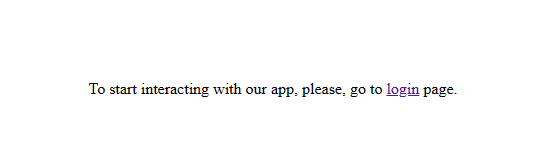
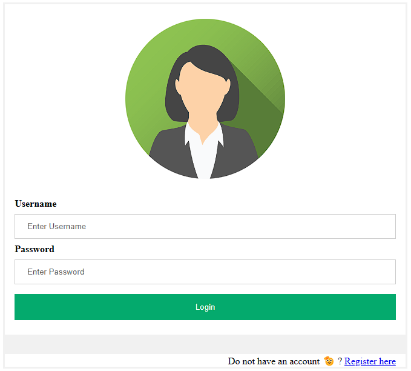
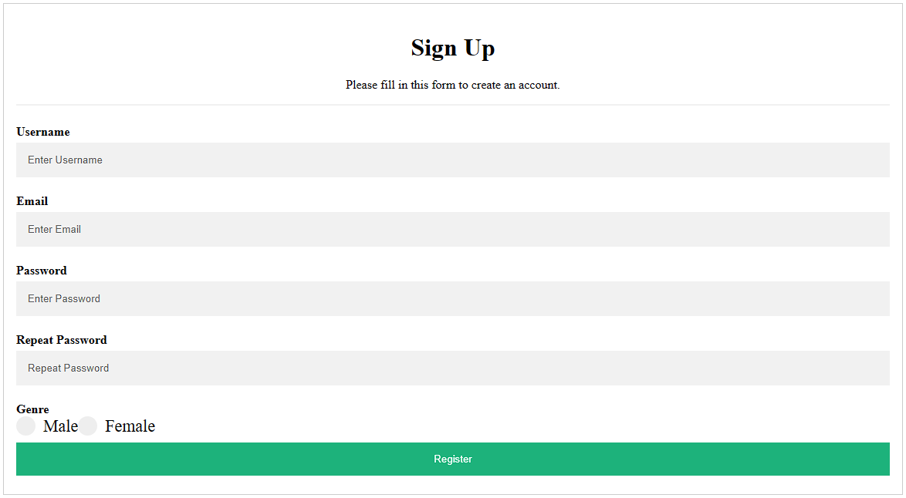
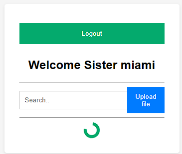
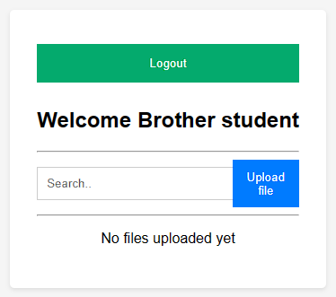
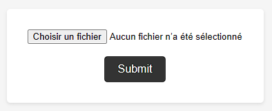
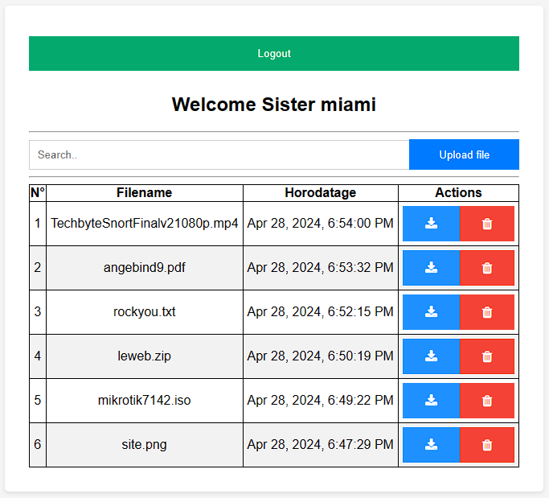
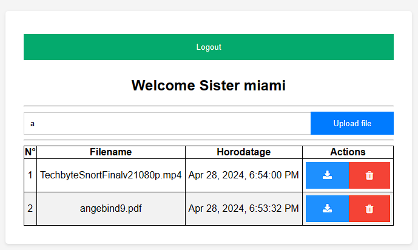
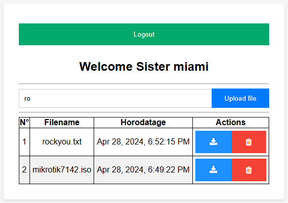
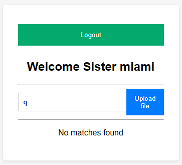

## README.md
I connect the frontend app (Next.js) with the backend app (Django).

When you connect to the frontend application, you will see a message showing you the login page direction.

|  |
|---|

At the login, you have the option to create an account if you do not have yet.

|  |
|---|

You can go to register page to create one.

|  |
|---|

In login and register page, i implement server-side validation using [zod](https://zod.dev/?id=introduction), a typescript library to validate data before contacting the backend app for further processing.

Successful login triggers user redirection to the home page where data are fetching from the backend app.

|  |
|---|

|  |
|---|

As soon as user clicks on `Upload file` button, a form for submitting file is displayed.

|  |
|---|

User uploads are registered in the backend and a FTP server for storage stuff, and the table gets filled with user data. 

A challenge was to add `Download` and `Delete` functionalities. Thanks to God and my motivation, i did it 😊.

|  |
|---|

So, it's your turn to clone that repo and enjoy my app 🥰.

A nice feature that i've also added to my app is the filtering. By typing something in the search bar, only files which names match that pattern appears in the table.

|  |
|---|

|  |
|---|

In case of no matching, `No matches found` is displayed to users.

|  |
|---|