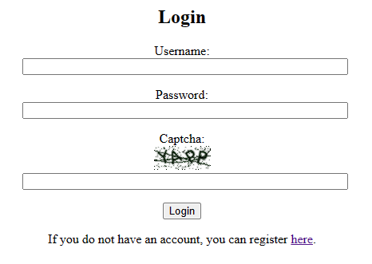
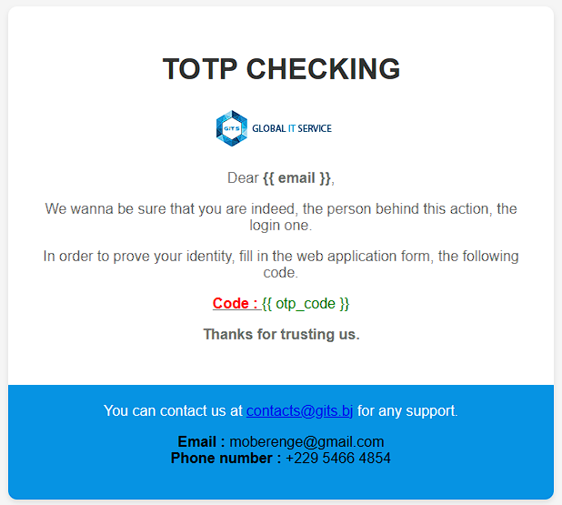
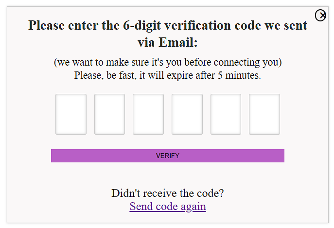
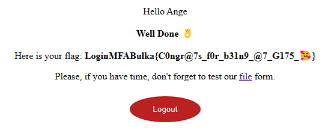
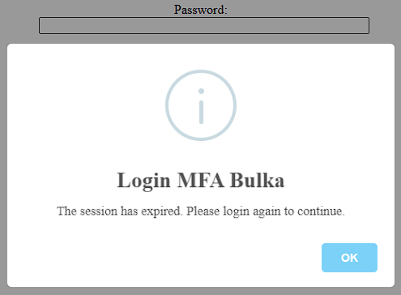
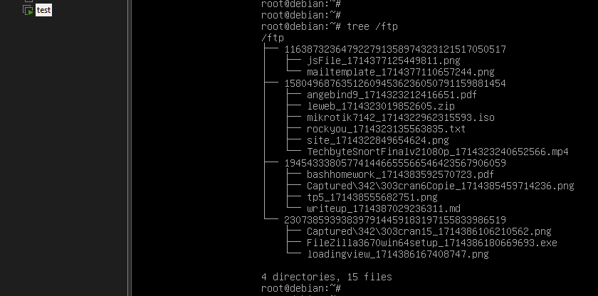
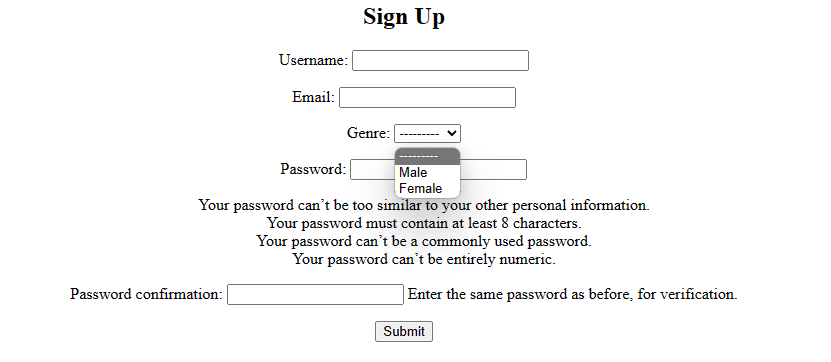

## BACKEND DJANGO APP
This django project contains 3 applications :
-   authentication (where i've implemented a standard robust login using captcha and 2FA feature)
-   files (where i've implemented a backend logic, an APIView model, to handle users' uploads via GET, POST and DELETE requests)
-   users (where i've created a new User model with AbstractBaseUser)

## AUTHENTICATION APP
I use [django-simple-captcha](https://django-simple-captcha.readthedocs.io/en/latest/usage.html#adding-to-a-form) to add a captcha field into the login form.
|  |
|---|

As soon as users enter valid credentials (username and password) and fill the captcha field correctly, an email message is sent to their email address (provided at registration) with an OTP (One-Time Passed) code, a 6-digits string, which validity is set to 5 minutes after storing those credentials plus the generated code and the expiration timestamp into session.
|  |
|---|

Users are automatically redirected to a view designed for providing code. In that view, i let user ask for another code if needed.
|  |
|---|

Once a valid code has been entered, users are redirected to the home page.
|  |
|---|

Also, using [django-auto-logout](https://pypi.org/project/django-auto-logout/), i set the session timeout and session idle timeout to improve security.
|  |
|---|

Some credentials are `miami:m1cHig@n`, `Ange:mP789456123*` and `student:Dr@g0nzzz`.

## FILES APP
In this app, i create an APIView to manage file uploads on the server. 
Only GET, POST and DELETE methods are allowed on my API.
I customize my POST method to fit either single or multiple uploads at a time.
The GET methods helps users viewing all files they have already uploaded, to filter according to filenames via the search parameter.
By calling DELETE, files are deleted on the storage and the database.
To deal with that, i create a custom [File model](./authentication/models.py).
Instead of storing uploaded files in the default media folder, i use [django-storages](https://django-storages.readthedocs.io/en/latest/) to store them on a FTP server.
That server serves those files through a Nginx server. Make sure directory listing is turned off on that web server.
|  |
|---|

## USERS APP
Here, i create a custom user model and bind it to a register form.
|  |
|---|
